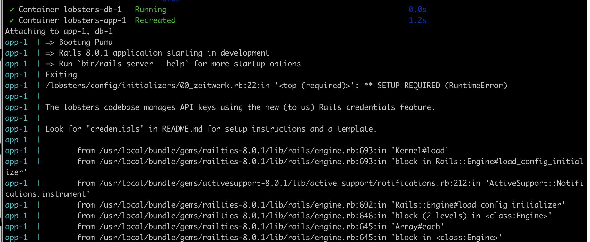
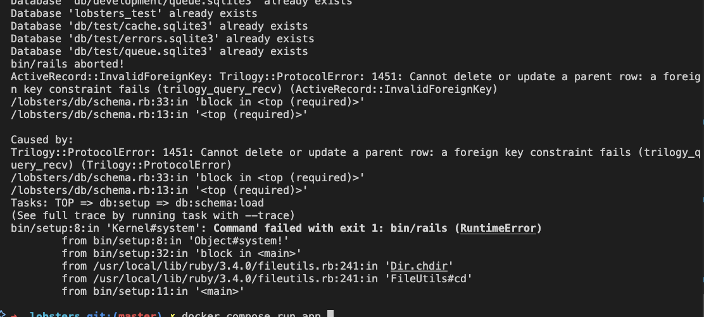

# About
Devcontainers allow you to have the experience of a local dev environment within a containerized environment.
This gives you the portability of docker - you can run a dev environment on any OS or even in the cloud (through Github codespaces), but your editor will look and act like you have the codebase set up locally.

# Installation

* Install docker on your machine. Follow the official guide on docker.com.
* Install an editor that supports devcontainers.
  * VS Code with the [Dev Containers extension](https://marketplace.visualstudio.com/items?itemName=ms-vscode-remote.remote-containers) is a good choice.
* Create a fork of the repo
* Clone repo using https - `git clone https://github.com/[USER_NAME]/lobsters.git`
  * https is **strongly recommended** due to how devcontainers handle authentcation with GitHub
* Change to the lobsters directory - `cd lobsters` OR `code -r lobsters` if you're using VS Code.
* Copy the database config - `cp config/database.yml.sample config/database.yml`
* Reopen the code within the devcontainer
  * For VS Code - [CMD+Shift+P] then select "Dev Containers: Reopen in Container"
* Change the credentials:
  * Create a new terminal tab
  * Run `VISUAL="code --wait" bin/rails credentials:edit`
    * Copy content from `config/credentials.yml.enc.sample` and paste it in the editor
* Run `bin/setup`
* Create the fake data by running `rails fake_data`
  * Note: this will take 2-5 minutes
* Start the server with `rails s -b 0.0.0.0`
* Confirm the server is running by navigating to [http://0.0.0.0:3000](http://0.0.0.0:3000)

# Common errors

Solution: Redo step "Change the credentials":

Solution:

* Run `rails db:drop`
* Run `rails db:setup`

**Docker container starts, but devcontainer hangs forever and never attaches**
"Close the remote conection" and then "Reopen in container" - this is an issue where VS Code is trying to attach before the devcontainer is truly ready.

# Setting up Git

* [Share your git credentials](https://code.visualstudio.com/remote/advancedcontainers/sharing-git-credentials) with all devcontainers you use.
or
* run `gh auth login` to generate credentials within the container

# Running tests

* Run `bundle exec rspec`
