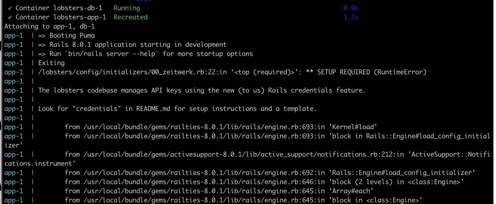
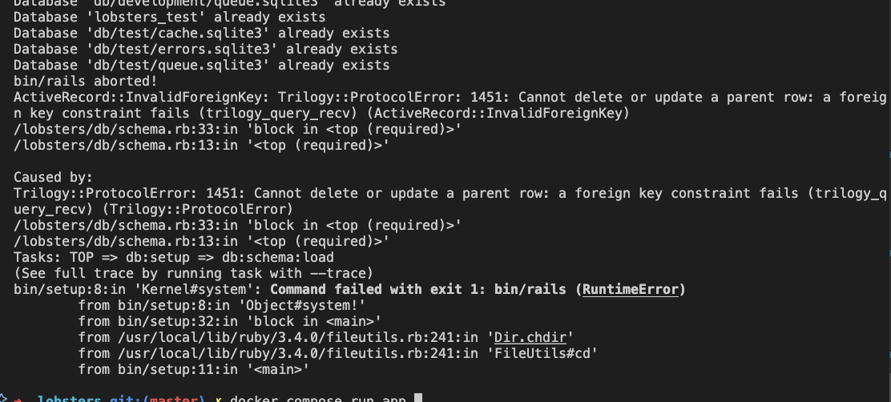

# Installation

* Install docker on your machine. Follow the official guideline on docker.com.
* Create a fork of the repo
* Clone repo using https - `git clone https://github.com/[USER_NAME]/lobsters.git`
* Reopen the code within the devcontainer
* Change the credentials:
  * Create a new terminal tab
  * Run `VISUAL="code --wait" bin/rails credentials:edit`
    * Copy content from `config/credentials.yml.enc.sample` and paste it in the editor
* Run `bin/setup`
* Create the fake data by running `rails fake_data`
  * Note: this will take 2-5 minutes
* Run `rails s -b 0.0.0.0` to start the server
* Confirm the server is running by navigating to `http://0.0.0.0:3000`

# Common errors

Solution: Redo step "Change the credentials":

Solution:

* Run `rails db:drop`
* Redo steps starting at "Switch back to the tab running the mariadb image and restart the server by:"

# Setting up Git

* [Share your git credentials](https://code.visualstudio.com/remote/advancedcontainers/sharing-git-credentials) with all devcontainers you use.
or
* run `gh auth login` to generate credentials within the container

# Running tests

* Run `bundle exec rspec`
