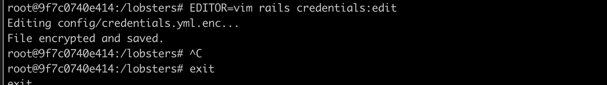
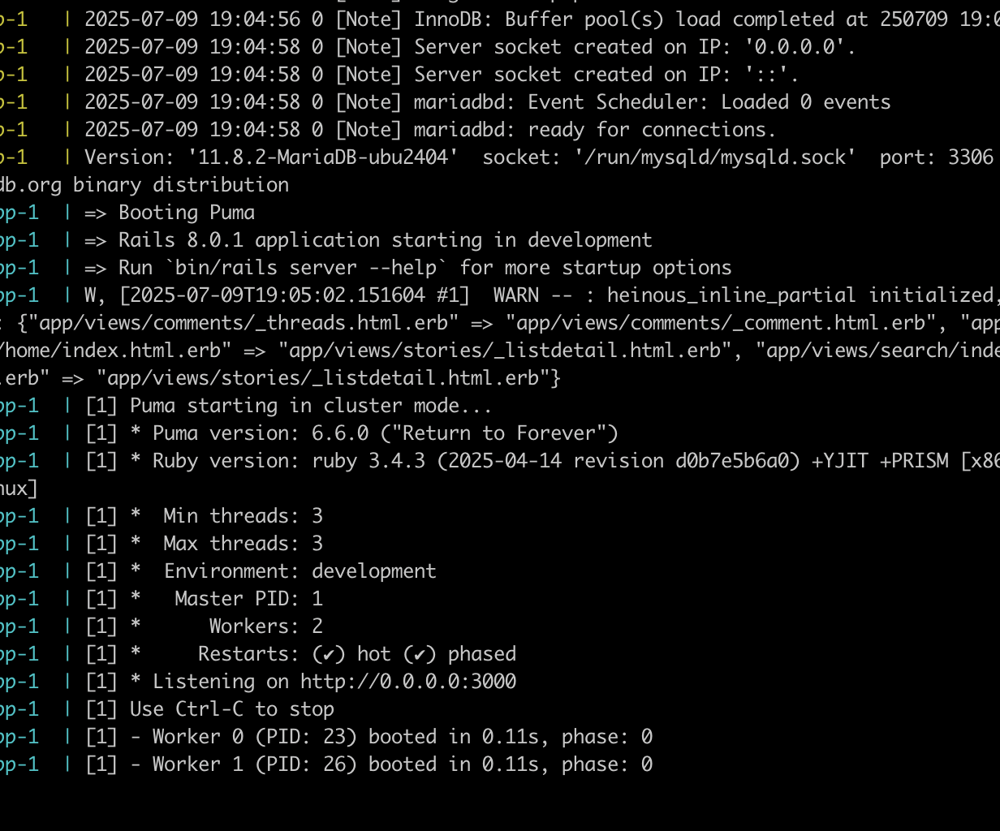

# Installation

* Install docker on your machine. Follow the offical guideline on docker.com.
* Create a fork of the repo
* Clone repo `git clone https://github.com/[USER_NAME]/lobsters.git`
* Run `make docker-serve`
  * This will pull a mariadb image and start two containers: one for web and another for the database
* Change the credentials:
  * Create a new terminal tab
  * Run `docker compose run app bash`
  * Run `EDITOR=vim rails credentials:edit`
    * Note: This will open vim in the container
    * Copy content from `config/credentials.yml.enc.sample` and paste it in the vim editor by right clicking on your mouse and clicking paste
    * To save your changes and exit vim press `:` key, type `wq` and press enter
    * You should get a similiar image like this:
   

* Update `database.yml`
  * Change line 5 to `host: db`
  * Add the below code to yoru development primary and test primary:

```
  username: root
  password: localdev
```

  * It should look like something like this:

```
  development:
  primary:
    <<: *trilogy
    database: lobsters_development
    username: root
    password: localdev
```

* Switch back to the tab running the mariadb image and restart the server by:
  * Holding down `control` and `c`
  * Run `make docker-serve`
  * You should see something like this:
  
* In another terminal, Run `docker compose run app bin/setup`
* Create the fake data by running `docker compose run app rails fake_data`
  * Note: this will take 2-5 minutes
* Confirm the server is running by navigating to `http://0.0.0.0:3000`

# Common errors


Solution: Redo step "Change the credentials":


Solution:

* Run `docker compose run app db:drop`
* Redo steps starting at "Switch back to the tab running the mariadb image and restart the server by:"
